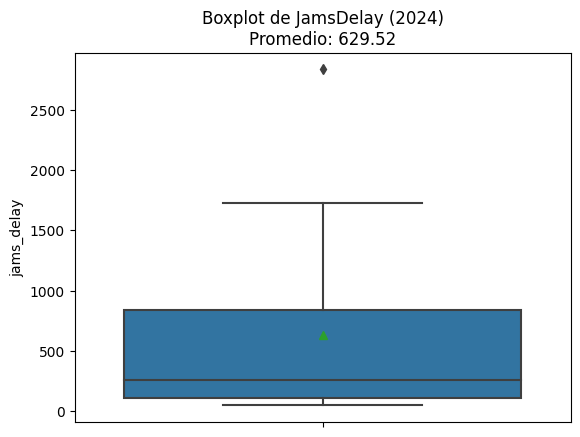
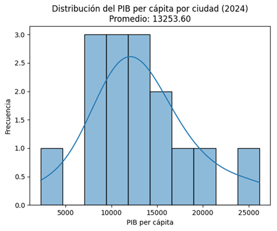
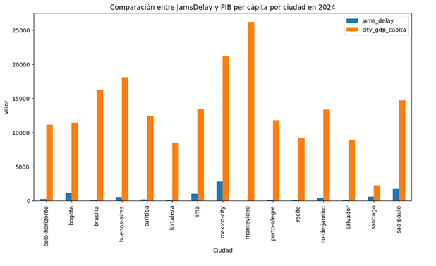

# 🚦 Urban Mobility Analysis in Latin America


## 📌 Project Overview

Traffic congestion is one of the main challenges affecting large cities in Latin America. Beyond increasing travel times, congestion impacts productivity, sustainability, and the quality of life of citizens.

This project analyzes urban mobility and economic indicators to explore whether cities with higher traffic congestion also exhibit lower economic productivity. The analysis integrates mobility data from the TomTom Traffic Index with economic indicators from the OECD City Economy dataset.

---

## 🎯 Business Objective

The objective of this project is to evaluate the relationship between urban mobility and economic performance across Latin American cities.

The analysis aims to answer the following business question:

> **Is there a relationship between traffic congestion and economic productivity in Latin American cities?**

The results can support future transportation planning and infrastructure investment decisions.

---

## 📂 Dataset

This project combines information from two public datasets:

- **TomTom Traffic Index**
  - Traffic congestion indicators
  - Travel times
  - Delay due to congestion

- **OECD City Economy Dataset**
  - GDP per capita
  - Population
  - Unemployment
  - Air pollution (PM2.5)

The analysis focuses on **2024**, covering **15 cities across 7 countries** after data cleaning and integration.

---

## 🛠 Technologies

- Python
- Pandas
- NumPy
- Matplotlib
- Jupyter Notebook

---

## 📁 Project Structure

```
urban-mobility-latam-analysis
│
├── data
│   ├── raw
│   └── processed
│
├── images
│
├── notebook
│   └── urban_mobility_analysis.ipynb
│
└── README.md
```

---

## 🔄 Project Workflow

The analysis follows these main steps:

1. Load datasets
2. Explore data
3. Clean and prepare data
4. Standardize column names
5. Convert data types
6. Create new features
7. Aggregate traffic indicators by city and year
8. Merge mobility and economic datasets
9. Perform exploratory data analysis (EDA)
10. Generate business insights
11. Export the cleaned dataset

---

# 📊 Exploratory Data Analysis

## Distribution of Traffic Delay



The boxplot shows that most cities have moderate congestion levels, while a few cities present considerably higher traffic delays. Mexico City appears as a clear outlier, indicating exceptionally high congestion.

---

## Distribution of GDP per Capita



GDP per capita follows an approximately normal distribution with moderate dispersion. Most cities are concentrated around the average, with a few higher-income cities creating a slight right skew.

---

## Traffic Congestion vs GDP per Capita



Comparing traffic delay and GDP per capita across cities suggests that higher economic productivity does not necessarily imply lower congestion.

Several cities with high GDP also experience significant traffic delays.

---

# 📈 Key Findings

- Mexico City presents the highest average traffic delay.
- Bogotá shows relatively high congestion combined with comparatively lower GDP per capita.
- Buenos Aires has lower congestion while maintaining higher economic productivity.
- No strong linear relationship was identified between traffic congestion and GDP per capita.
- Correlation between congestion indicators and economic productivity is weak.

---

# 💼 Business Recommendations

Based on the analysis:

- Prioritize deeper mobility studies for Bogotá due to its combination of high congestion and relatively lower productivity.
- Use additional socioeconomic and transportation variables before making investment decisions.
- Incorporate historical data to evaluate long-term mobility trends.
- Consider public transportation coverage, infrastructure investment, and commuting patterns in future analyses.

---

# 📄 Deliverables

- Clean integrated dataset
- Jupyter Notebook with complete analysis
- Exploratory visualizations
- Business conclusions
- Actionable recommendations

---

# 🚀 How to Run

Clone this repository:

```bash
git clone https://github.com/islenaromero/urban-mobility-latam-analysis.git
```

Install dependencies:

```bash
pip install pandas numpy matplotlib
```

Open:

```
notebook/urban_mobility_analysis.ipynb
```

Run all cells.

---

# 👩‍💻 About the Author

**Islena Romero**

Telecommunications Engineer transitioning into Data Analytics.

Passionate about transforming data into actionable business insights through analytics and visualization.

### Skills

- Python
- SQL
- Power BI
- Excel
- Pandas
- Data Visualization

GitHub:
https://github.com/islenaromero

LinkedIn:
www.linkedin.com/in/islena-romero-londoño

---

## ⭐ If you found this project useful, feel free to star this repository.
